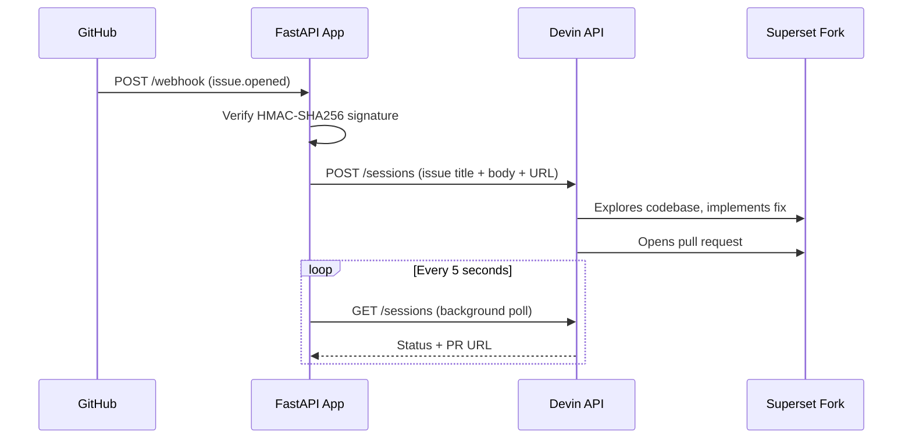
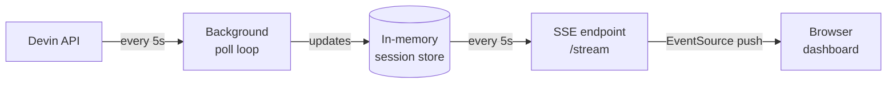
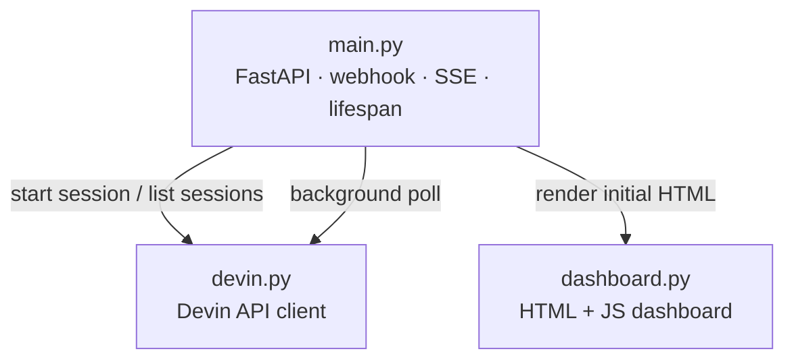

# Superset Devin Automation

An event-driven automation that uses the Devin API to autonomously remediate Github Issues when created. The system automatically triggers a Devin session to fix it and open a pull request. A live dashboard tracks every session in real time.

---

## How it works

```
GitHub issue opened
        ↓
GitHub fires webhook to this app
        ↓
App verifies request and calls Devin API
        ↓
Devin works autonomously in its virtual space and opens a pull request
        ↓
Dashboard tracks every session in real time
```

---

## Architecture

### Automation pipeline

When a GitHub issue is opened, the event travels through the system end to end:



### Real-time dashboard

The dashboard does not reload the page. A background loop polls Devin independently, and SSE pushes the result to the browser:



### Component overview



---

## Project structure

```
superset-devin-automation/
├── app/
│   ├── main.py          # FastAPI app — webhook receiver, session tracker, dashboard
│   ├── devin.py         # Devin API client — start sessions, poll status, list sessions
│   └── dashboard.py     # Live HTML dashboard generator
├── .env                 # Secret credentials (not committed — copy from .env.example)
├── .env.example         # Template with required variable names
├── .gitignore
├── docker-compose.yml
├── Dockerfile
├── requirements.txt
└── README.md
```

---

## Prerequisites

- Docker Desktop
- ngrok account (free tier) — https://ngrok.com
- Devin Enterprise account with API access
- GitHub account with a forked copy of apache/superset

---

## Setup

### 1. Clone the repository

```bash
git clone https://github.com/dhshin1818/superset-devin-automation.git
cd superset-devin-automation
```

### 2. Configure environment variables

Copy `.env.example` to `.env` and fill in your values:

```bash
cp .env.example .env
```

```env
DEVIN_API_KEY=cog_your_api_key_here
DEVIN_ORG_ID=org_your_org_id_here
GITHUB_WEBHOOK_SECRET=your_webhook_secret_here
GITHUB_REPO=your_github_username/your_superset_fork
```

| Variable | Where to find it |
|---|---|
| `DEVIN_API_KEY` | Devin settings → API → Service users → Provision service user → Generate API key |
| `DEVIN_ORG_ID` | Devin settings → API → Organization ID |
| `GITHUB_WEBHOOK_SECRET` | Any random string you choose — must match what you set in GitHub webhook settings |
| `GITHUB_REPO` | The GitHub repo where issues will be monitored (e.g. `your_username/superset-cognition-demo`) |

### 3. Connect Devin to GitHub

In your Devin workspace at app.devin.ai, connect your GitHub account and grant access to your forked Superset repository. This allows Devin to read your code, push branches, and open pull requests.

### 4. Set up ngrok

Start ngrok to expose your local app to GitHub:

```bash
ngrok http 8000
```

Copy the public URL (e.g. `https://xyz.ngrok-free.app`). You will need this for the GitHub webhook setup below.

Note: ngrok URLs change on every restart. Update the GitHub webhook URL each time you restart ngrok.

### 5. Set up GitHub webhook

In your forked Superset repository on GitHub, go to Settings → Webhooks → Add webhook and fill in:

- Payload URL: `https://xyz.ngrok-free.app/webhook`
- Content type: `application/json`
- Secret: same value as `GITHUB_WEBHOOK_SECRET` in your `.env`
- Events: select Issues only, specifically the opened action

### 6. Run the app

```bash
docker compose up --build
```

The app will be available at `http://localhost:8000`.

---

## Dashboard

Open your browser and go to:

```
http://localhost:8000/dashboard
```

The dashboard shows:

- Summary metrics at the top — total sessions, completed, in progress, waiting, failed, PRs merged
- A session table with title, Devin session link, status, pull request link, Devin Review link, PR state, created time, and last updated time
- Updates live via Server-Sent Events (SSE) — no page reloads

---

## Triggering a Devin session

Create a new issue in your forked superset-cognition-demo repository. The webhook fires automatically and Devin begins working within seconds.

Example issue:

**Title:** `Upgrade Pillow to latest stable version`

**Body:**
```
## Problem
Pillow is pinned to an older version in requirements/base.txt.
Multiple CVEs exist in older Pillow versions affecting image parsing.

## Task
- Find current Pillow version in requirements/base.txt
- Upgrade to latest stable version
- Verify no breaking changes

## Acceptance Criteria
- [ ] Pillow version updated in requirements/base.txt
- [ ] No import or runtime errors
- [ ] Existing tests pass
```

---

## API endpoints

| Endpoint | Method | Description |
|---|---|---|
| `/webhook` | POST | Receives GitHub issue events and triggers Devin |
| `/dashboard` | GET | Live HTML dashboard showing all session statuses |
| `/status` | GET | JSON response with all session statuses |
| `/health` | GET | Health check — returns `{"status": "ok"}` |

---

## Key architectural decisions

**Webhook signature verification** — every incoming request from GitHub is verified using HMAC SHA-256 against the shared webhook secret before any action is taken. This prevents spoofed requests.

**Startup session loader** — on startup the app calls the Devin API and loads all existing sessions automatically. The dashboard is never empty even after a restart.

**Archived session filtering** — sessions marked as archived in Devin are automatically excluded from the dashboard. Only active and completed sessions relevant to the configured repository are shown.

**Service account** — all Devin sessions are created under a named service user (`superset-remediation-bot`) rather than under any individual's credentials. Every action is fully auditable and scoped to only the permissions it needs. This is standard practice for automation in regulated environments.

**Generic prompt design** — the prompt sent to Devin is intentionally issue-agnostic. It passes the issue title, body, and URL directly to Devin and lets it reason about what needs to be done. This means the same system handles dependency upgrades, security fixes, documentation, test coverage, and any other issue type without any changes to the code.

**In-memory session store** — sessions are stored in memory during the app's lifetime and hydrated from the Devin API on startup. For a production deployment this would be replaced with a persistent database.

---

## Extending this system

In a real customer engagement this system would be extended in three directions:

**Ticketing system integration** — connect to Jira or Linear so engineers do not need to create GitHub issues manually. The ticket they already create becomes the trigger.

**Slack or Teams notifications** — notify the relevant engineer the moment Devin opens a pull request, with a direct link to the pull request and Devin Review summary.

**Nightly scanner** — run an automated dependency or vulnerability scanner on a schedule that automatically creates issues for anything it surfaces. At that point the entire flow from detection to remediation runs without any human involvement until the pull request review.

---

## Forked repository

The Apache Superset fork used in this project:

```
https://github.com/dhshin1818/superset-cognition-demo
```

---

## Dependencies

```
fastapi
uvicorn
httpx
python-dotenv
```

Install with:

```bash
pip install -r requirements.txt
```

---

## Notes

- The `.env` file is excluded from version control via `.gitignore` 
- The `venv/` folder is also excluded — run `pip install -r requirements.txt` to recreate it
- In a production deployment, ngrok would be replaced by a cloud VM or Kubernetes cluster with a permanent public URL